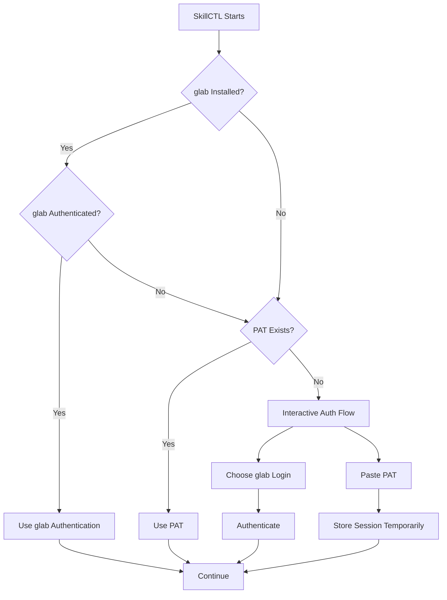
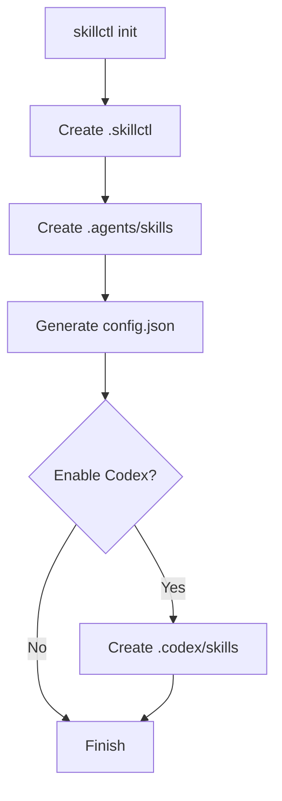
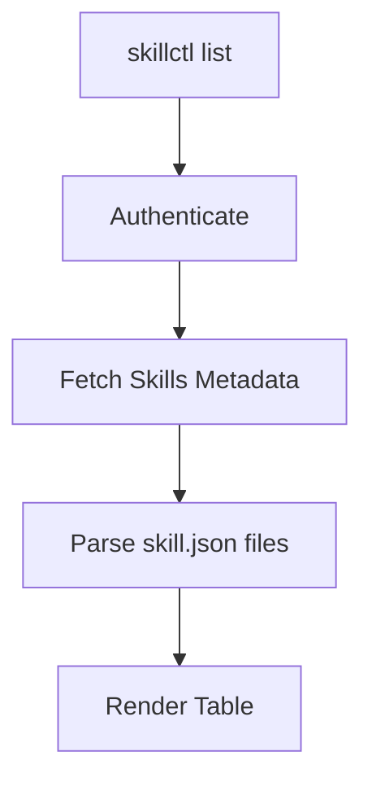
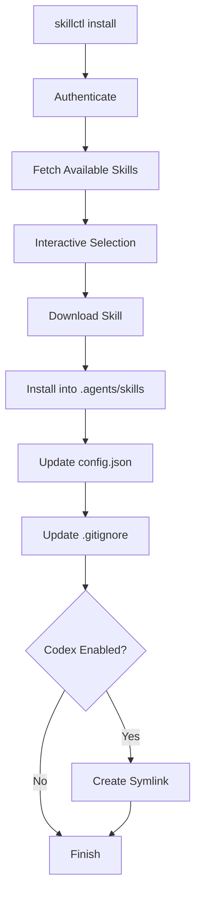
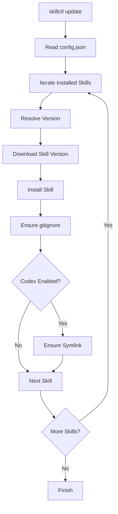
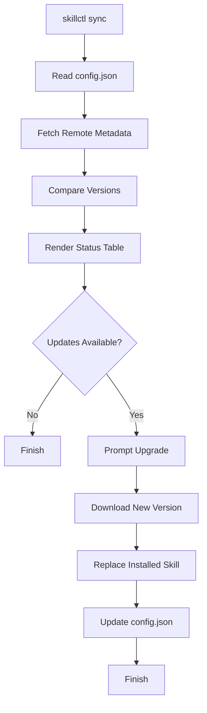
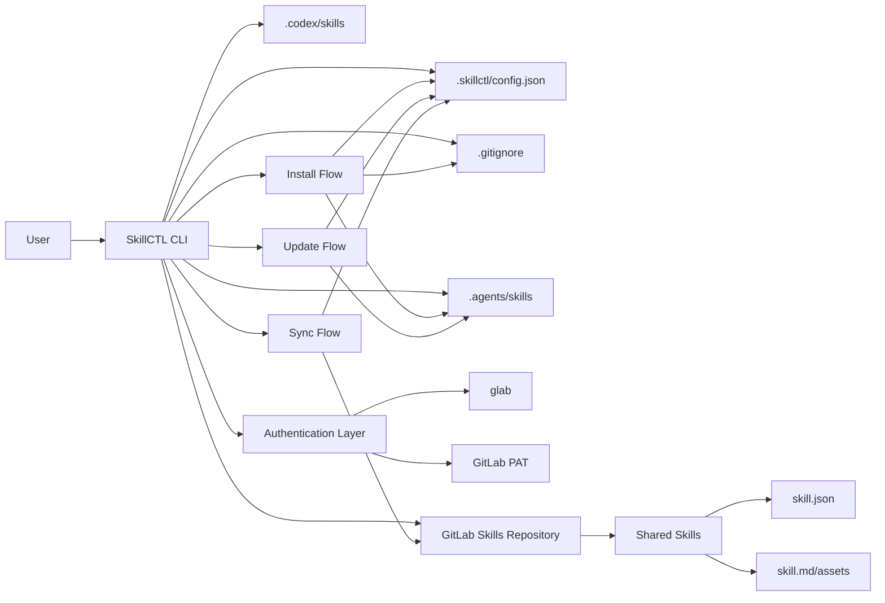

# SkillCTL — Distributed Skills Management CLI

## Overview

SkillCTL is a terminal-first CLI designed to manage reusable AI agent skills shared from a centralized GitLab repository.

The goal is to allow repositories to:

- Discover available shared skills
- Install them locally
- Lock versions in repository config
- Reproduce the same setup across developers
- Synchronize updates safely
- Support multiple agent ecosystems (initially OpenCode and Codex)

The tool is intentionally repository-centric.

Each repository declares:

- Which skills are installed
- Which versions are expected
- Which agent targets are enabled

This allows any developer to clone the repository and reproduce the exact same skill setup using a single command.

---

# Core Concepts

## Skills Repository

A centralized GitLab repository containing reusable skills.

Example:

```text
common-skills/
  skills/
    react-native-review/
    gitlab-ci-review/
    release-validator/
```

Each skill contains:

- metadata
- description
- version
- entrypoint file
- optional assets

---

## Consumer Repository

Any repository using SkillCTL.

Example:

```text
mobile-app/
backend-api/
internal-tools/
```

Each consumer repository contains:

```text
.skillctl/
.agents/skills/
.codex/skills/
```

---

## Managed Skills

Skills installed and tracked by SkillCTL.

Managed skills are declared in:

```text
.skillctl/config.json
```

SkillCTL ONLY manages skills declared there.

This prevents accidental deletion or modification of user-owned skills.

---

# Goals

## Primary Goals

- Portable skill installation
- Reproducible environments
- Version-locked skills
- Interactive UX
- Multi-agent compatibility
- Git-friendly behavior
- Safe coexistence with manual skills

---

# Non Goals (Initial Version)

- Skill publishing
- Skill dependency resolution
- Nested skills
- Skill marketplaces
- Windows support
- Remote execution
- Automatic migrations
- Multi-registry support

---

# Recommended Technology Stack

## Language

Rust.

---

## Rationale

Rust provides:

- Single static binaries
- Excellent macOS/Linux support
- Strong filesystem safety
- High reliability
- Fast execution
- Modern CLI ecosystem
- Strong typing for config/version management

---

# Rust Crates

## CLI Parsing

```toml
clap = { version = "4", features = ["derive"] }
```

---

## Interactive CLI

```toml
dialoguer = "0.11"
console = "0.15"
colored = "2"
```

---

## Future Full TUI

```toml
ratatui = "0.29"
crossterm = "0.28"
```

---

## Serialization

```toml
serde = { version = "1", features = ["derive"] }
serde_json = "1"
```

---

## HTTP

```toml
reqwest = { version = "0.12", features = ["json", "blocking", "rustls-tls"] }
```

---

## Error Handling

```toml
anyhow = "1"
thiserror = "2"
```

---

## Version Handling

```toml
semver = "1"
```

---

# Repository Structure

## Consumer Repository Layout

```text
repo/
  .skillctl/
    config.json

  .agents/
    skills/
      react-native-review/
      gitlab-ci-review/

  .codex/
    skills/
      react-native-review -> ../../.agents/skills/react-native-review

  .gitignore
```

---

# Configuration File

## Path

```text
.skillctl/config.json
```

---

## Example

```json
{
  "version": 1,
  "targets": {
    "opencode": true,
    "codex": true
  },
  "skillsRepo": {
    "provider": "gitlab",
    "project": "group/common-skills"
  },
  "skills": [
    {
      "name": "react-native-review",
      "version": "1.2.0",
      "installedPath": ".agents/skills/react-native-review"
    },
    {
      "name": "release-validator",
      "version": "0.4.1",
      "installedPath": ".agents/skills/release-validator"
    }
  ]
}
```

---

# Skills Repository Layout

## Structure

```text
common-skills/
  skills/
    react-native-review/
      skill.json
      skill.md
      assets/

    gitlab-ci-review/
      skill.json
      skill.md
```

---

## skill.json

```json
{
  "name": "react-native-review",
  "description": "Reviews React Native code and architecture",
  "version": "1.2.0",
  "entrypoint": "skill.md"
}
```

---

# Authentication

SkillCTL supports two authentication mechanisms.

---

## Method 1 — glab

If `glab` exists and is authenticated:

```bash
glab auth status
```

SkillCTL automatically uses it.

---

## Method 2 — GitLab PAT

Environment variable:

```bash
SKILLCTL_GITLAB_TOKEN
```

or interactive prompt.

---

## Authentication Flow



---

# Commands

# skillctl init

Initializes the repository.

---

## Responsibilities

- Create `.skillctl/`
- Create `.agents/skills/`
- Create base config
- Ask about Codex integration
- Create `.codex/skills/` if enabled

---

## Flow



---

## Example

```bash
skillctl init
```

Interactive:

```text
Enable Codex integration? [y/N]
```

---

# skillctl list

Lists available skills from the shared repository.

---

## Responsibilities

- Authenticate
- Fetch skills metadata
- Render interactive table
- Show name/description/version

---

## Example Output

```text
Available Skills

┌─────────────────────────┬──────────────────────────────────────────────┬─────────┐
│ Skill                   │ Description                                  │ Version │
├─────────────────────────┼──────────────────────────────────────────────┼─────────┤
│ react-native-review     │ Reviews React Native code and architecture   │ 1.2.0   │
│ gitlab-ci-review        │ Reviews GitLab pipelines                     │ 0.3.0   │
│ release-validator       │ Validates release notes and assets           │ 0.4.1   │
└─────────────────────────┴──────────────────────────────────────────────┴─────────┘
```

---

## Flow



---

# skillctl install

Installs selected skills.

---

## Responsibilities

- Interactive skill selection
- Download skill contents
- Install into `.agents/skills`
- Update config.json
- Create Codex symlink if enabled
- Update `.gitignore`

---

## Interactive Selection

```text
? Select a skill to install

> react-native-review
  gitlab-ci-review
  release-validator
```

---

## Installation Flow



---

## Gitignore Rules

SkillCTL NEVER adds:

```gitignore
.agents/skills/
.codex/skills/
```

Instead it adds specific paths:

```gitignore
.agents/skills/react-native-review
.codex/skills/react-native-review
```

This prevents interfering with manually managed skills.

---

# skillctl update

Reproduces installed skills from config.

Main use case:

A developer clones a repository and restores all required skills.

---

## Responsibilities

- Read config.json
- Download exact versions
- Reinstall missing skills
- Recreate symlinks
- Ensure gitignore entries

---

## Important Behavior

`update` DOES NOT upgrade versions.

It only reproduces the repository state.

---

## Flow



---

# skillctl sync

Checks for newer versions of installed skills.

---

## Responsibilities

- Compare local versions
- Compare remote versions
- Show upgrade candidates
- Offer interactive upgrade

---

## Example

```text
┌─────────────────────────┬───────────┬────────┬──────────┐
│ Skill                   │ Installed │ Latest │ Status   │
├─────────────────────────┼───────────┼────────┼──────────┤
│ react-native-review     │ 1.2.0     │ 1.3.0  │ update   │
│ release-validator       │ 0.4.1     │ 0.4.1  │ current  │
└─────────────────────────┴───────────┴────────┴──────────┘
```

---

## Flow



---

# Filesystem Rules

## Managed Scope

SkillCTL only manages:

```text
.agents/skills/<skill>
.codex/skills/<skill>
```

for skills declared in config.json.

---

## Non Managed Content

SkillCTL must NEVER:

- Delete unknown skills
- Rewrite user-owned skills
- Replace unmanaged symlinks
- Overwrite unrelated gitignore entries

---

# Versioning Strategy

## Initial Proposal

Versions come from:

```json
skill.json
```

and optionally Git tags later.

---

## Semver

SkillCTL uses:

```text
MAJOR.MINOR.PATCH
```

via Rust `semver` crate.

---

# Development Mode

SkillCTL supports local development against filesystem repositories.

---

## Environment Variables

```bash
SKILLCTL_SKILLS_REPO=group/common-skills
SKILLCTL_GITLAB_TOKEN=xxxxx
SKILLCTL_SKILLS_REPO_PATH=/local/path/to/common-skills
```

---

## Resolution Priority

1. Local filesystem path
2. GitLab project
3. Default configured project

---

# Docker Build

## CI Dockerfile

```dockerfile
FROM rust:1.89-bookworm AS build

WORKDIR /src

COPY . .

RUN cargo build --release

FROM debian:bookworm-slim

COPY --from=build /src/target/release/skillctl /usr/local/bin/skillctl

ENTRYPOINT ["skillctl"]
```

---

# Local Build

## Native

```bash
cargo build --release
```

---

## Docker

```bash
docker build -t skillctl-build .
```

---

# Full System Interaction Diagram



---

# Future Extensions

## Planned Future Features

- Categories
- Search/filtering
- uninstall command
- Skill locking
- Checksums
- Release assets
- GitLab Releases integration
- Skill publishing
- Multiple registries
- Remote registry mirrors
- Skill dependency graphs
- ratatui full-screen mode

---

# MVP Scope

## Included

- init
- list
- install
- update
- sync
- glab auth
- PAT auth
- OpenCode support
- Codex symlink support
- JSON config
- gitignore management
- Semver comparison

---

## Excluded

- Publishing
- Windows
- Multiple registries
- Auto migrations
- Dependency resolution
- Registry authentication persistence

---

# Summary

SkillCTL provides:

- Shared reusable skills
- Version reproducibility
- Safe repository-local installs
- Multi-agent compatibility
- Interactive terminal UX
- Git-friendly behavior
- Portable developer onboarding

The architecture intentionally prioritizes:

- simplicity
- reproducibility
- safety
- extensibility
- repository isolation

